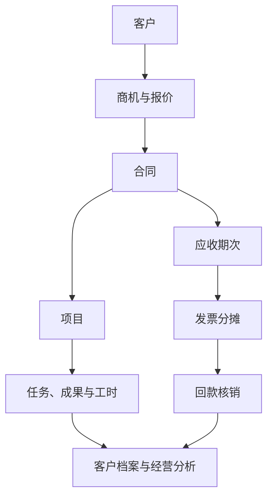
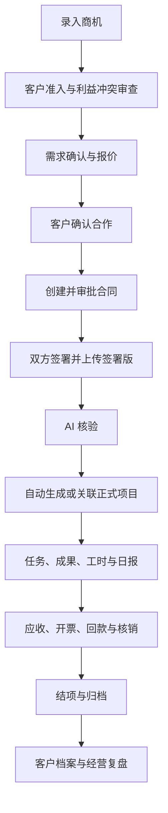

# 文森 AI 管理系统 V5.0 PRD（初稿）

> 文档状态：初稿，供业务评审  
> 产品版本：V5.0  
> 基线日期：2026-08-28  
> 适用范围：律师事务所客户、商机、合同、项目、工时、审批、财务与经营数据一体化管理

## 1. 产品概述

### 1.1 产品定位

文森 AI 管理系统面向律师事务所，将客户开发、报价、合同签署、项目执行、律师工时、流程审批、开票回款和经营分析连接为一套统一业务系统。

系统不以“增加更多台账”为目标，而是围绕同一客户、合同和项目建立统一数据链路：业务人员在前端完成商机和合同推进，律师在项目中完成任务、成果和工时记录，审批人处理风险与例外事项，财务基于合同和项目完成应收、开票、回款及核销，管理层最终通过客户档案和经营分析查看经营结果。

AI 贯穿各业务环节，用于信息提取、表单建议、合同核验、风险识别、工时合理性评估和经营洞察，但不替代人工审批和最终决策。

### 1.2 V5.0 目标

1. 建立从商机到经营复盘的完整业务闭环。
2. 减少客户、合同、项目和财务信息的重复录入。
3. 明确合同、项目、工时、发票、回款和核销之间的数据关系。
4. 让律师、负责人、审批人、财务和管理层在同一系统内协作。
5. 通过客户档案和经营分析，将业务过程数据转化为可解释的管理信息。

### 1.3 本期范围

- 个人中心：产品引导、工作台。
- 业务：商机管理、客户准入、报价、合同管理。
- 执行：项目管理、任务与成果、工时管理、工作日报、结项。
- 审批：统一流程审批、会签、抄送、催办和消息联动。
- 财务：应收计划、开票记录、回款记录、核销明细。
- 数据：客户档案、经营分析、AI 客户洞察和 AI 经营洞察。

### 1.4 暂不纳入 V5.0

- 跨合同或跨项目核销。
- 完整总账、会计凭证、税务申报和银行自动对账。
- 对外付款计划及供应商付款管理。
- 固化的日报绩效奖金计算规则。
- AI 自动批准、自动拒绝或替代责任人作出法律、财务决策。

## 2. 用户角色与权限

| 角色 | 核心职责 | 默认数据范围 | 关键权限 |
|---|---|---|---|
| 律师 | 执行项目、记录工作、提交日报 | 本人及本人参与的项目 | 查看参与项目；记录项目工时和非项目工作；提交日报；查看本人待办 |
| 项目负责人 | 管理项目交付、团队、进度与风险 | 本人负责的客户和项目 | 维护项目；审核工作日报；发起项目类审批；查看负责项目经营数据 |
| 审批人 | 处理各类业务审批 | 分配给本人的流程 | 审批；添加会签人；添加抄送人；查看审批依据与日志 |
| 业务/商机负责人 | 推进客户、需求、报价与签约 | 本人负责的商机和客户 | 新建商机；维护跟进；发起报价、客户准入和合同 |
| 财务 | 管理应收、发票、回款和核销 | 完整财务数据 | 发票登记；回款登记；核销；查看完整金额、币种与核销数据 |
| 管理层 | 经营管理与高风险事项决策 | 全局 | 查看全部客户、项目及经营数据；处理高风险审批 |
| 抄送人 | 知悉流程 | 被抄送的流程 | 只读查看，不参与审批，不修改业务数据 |

权限应同时作用于列表、详情、统计指标、导出和 AI 洞察。仅隐藏菜单不足以构成权限控制，服务端仍需按数据范围校验。

## 3. 核心业务对象与关系

### 3.1 核心对象

- 客户：合作主体及其联系人、准入和风险信息。
- 商机：客户需求从线索到确认合作的业务机会。
- 报价：商机下的价格方案及历史版本。
- 合同：经审批和双方签署的法律文件，一个合同只能归属一个项目。
- 项目：正式提供法律服务的执行单元，一个项目可关联多份合同。
- 任务：项目内的执行事项和待办。
- 成果：项目形成并交付或归档的文件与工作结果。
- 工作记录：一次具体工作及其时长、执行人、类型和业务归属。
- 工作日报：个人每日全部工作的汇总和审批载体。
- 审批流程：围绕客户、报价、项目、合同或财务事项发起的流程。
- 应收期次：根据合同付款条件生成的应收计划。
- 发票：实际开票记录。
- 开票分摊：发票金额在同一合同各应收期次之间的分配。
- 回款：银行实际到账记录。
- 核销明细：回款对发票和应收期次的金额分配。

### 3.2 关键关系

关系约束：

1. 一个客户可以拥有多个商机、合同和项目。
2. 一个商机可以形成多版报价，但只有最终确认且审批通过的报价可用于发起合同。
3. 一个合同只归属一个项目。
4. 一个项目可以关联一份或多份合同，包括项目生成后的补充合同、续签合同或变更后新合同。
5. 第一份合同完成双签并通过 AI 核验后，系统自动生成正式项目；后续合同可从已有项目发起并关联该项目。
6. 应收期次、发票、回款和核销必须归属于同一合同及该合同所属项目。
7. 当前版本禁止跨合同、跨项目核销。

## 4. 端到端业务主流程

### 4.1 标准主链路

### 4.2 关键业务门槛

- 商机未达到“客户确认合作”，不得从商机创建正式合同。
- 客户未通过准入和利益冲突审查，不得继续推进正式报价、合同或项目。
- 最终报价未确认或报价审批未通过，不得从商机发起合同。
- 合同审批通过不代表项目成立。
- 合同未完成双方签署或 AI 核验未通过，不得自动生成正式项目。
- 正式项目生成前，不得记录项目工时，也不得建立应收、开票、回款台账。
- 签约前沟通、报价等工作可以进入个人工作日报，但不得计入项目工时。
- 发票及其期次分摊不存在时，不得进行对应回款核销。
- 项目工作完成且全部款项收回后，方可完成常规结项；例外结项需走相应审批。

## 5. 功能需求

## 5.1 个人中心

### 5.1.1 产品引导

产品引导位于工作台之前，帮助新用户理解系统模块和标准业务链路。

页面应展示：

- 个人、业务、执行、审批、财务、数据六类场景。
- 标准链路：商机 → 合同 → 项目 → 执行 → 财务与结项 → 数据复盘。
- 按角色推荐的使用路径。
- 常用模块快捷入口。
- 关键门槛提示，如“合同双签并核验后才生成项目”。

### 5.1.2 工作台

工作台聚合当前用户最需要处理的信息：

- 我的待办：审批、项目任务、跟进任务和催办置顶任务。
- 我的工时：今日已记录、本周已记录、项目分布及快速记录入口。
- 业务提醒：合同待签、项目风险、回款提醒等。
- AI 建议：根据当前角色和待处理事项生成优先级建议。

业务规则：

- 已立项项目相关待办可直接“记录工时”。
- 商务跟进待办不进入项目工时。
- 发起人催办后，对应审批任务置于当前审批人“我的待办”首条，并显示催办标识和时间。
- “正在计时”在 V5.0 暂不展示。

## 5.2 商机、客户准入与报价

### 5.2.1 商机录入

支持手工创建，或粘贴微信、邮件、会议纪要，由 AI 提取：

- 客户和联系人。
- 客户需求与服务范围。
- 预算、时间要求和业务类型。
- 商机阶段、负责人和下一次跟进时间。

AI 提取后形成草稿，用户确认后保存，不直接生成正式客户或合同。

### 5.2.2 商机阶段

建议状态：初步接洽、需求确认、报价沟通、客户确认合作、合同签署中、已转项目、暂停、已关闭。

状态流转要求：

- 每次阶段变更记录操作人、时间和原因。
- 跟进记录与商机状态联动，支持在跟进时更新阶段。
- 暂停和关闭必须填写原因，可恢复至合理前置阶段。
- “客户确认合作”仅在客户准入完成、最终报价确认且报价审批通过后可用。

### 5.2.3 客户准入

- 新客户必须发起客户准入审批和利益冲突审查。
- 审批中的客户可以保留商机草稿，但限制正式报价、合同和项目动作。
- 审批通过后成为正式客户，后续信息汇入客户档案。
- 客户投诉、利益冲突复核和其他客户事项通过客户类审批处理。

### 5.2.4 报价管理

- 同一商机支持多版报价及版本历史。
- 报价包含标准收费、实际报价、折扣率、付款条件、报价方式和服务范围。
- 记录审批状态、发送时间、发送渠道及客户反馈。
- 首次报价、报价调整、特殊折扣和其他报价事项进入报价审批。
- 客户最终确认且审批通过的报价作为合同创建的数据来源。

## 5.3 合同管理

### 5.3.1 合同创建来源

合同必须具备业务来源，禁止孤立正式合同：

1. 从已达到“客户确认合作”的商机创建，自动带入客户、需求、最终报价、服务范围和负责人。
2. 从已有正式项目创建，用于补充合同、续签或新增服务约定，自动带入项目、客户、业务类型和负责人。

### 5.3.2 合同创建

创建页采用单页三卡片：

1. 来源与主体。
2. 合同与收费。
3. 执行安排与提交。

支持上传合同草案，由 AI 识别主体、金额、币种、期限、付款条件、服务范围和风险条款。用户可保存草稿或提交合同审批。

### 5.3.3 合同状态

建议状态：草稿、审批中、待签署、待上传签署版、AI 核验中、已生效、发现差异、变更中、已解除、已作废、已归档。

关键流转：

- 审批通过 → 待签署。
- 双方签署并上传签署版 → AI 对比审批版与签署版。
- 无实质差异 → 合同生效，并生成或关联正式项目。
- 发现实质差异 → “发现差异”，仅允许查看、重新上传或发起变更。
- 合同条款变更、服务范围变更、解除或作废必须走合同审批，不覆盖原记录。

### 5.3.4 合同详情

合同详情应完整展示：

- 合同基本信息。
- 客户与签约主体。
- 服务内容与合同期限。
- 金额、币种、收费及付款条件。
- 负责人和执行安排。
- 合同文件和 AI 核验结果。
- 商机、项目和财务关联链路。
- 审批及操作记录。

### 5.3.5 关联台账

合同列表和详情提供“关联台账”，包含应收计划、开票记录、回款记录、核销明细四个视图。

- 自动锁定当前合同和所属项目。
- 与财务管理使用同一数据源和同一计算逻辑。
- 任一入口新增或调整记录，另一入口即时同步。
- 项目尚未正式生成时，不建立财务台账。

## 5.4 项目管理

### 5.4.1 项目生成与关系

- 首份合同完成双签并通过 AI 核验后，系统自动生成正式项目。
- AI 根据合同建议项目名称、类型、负责人、成员、服务范围、计划周期和初始任务。
- 用户确认后形成项目基础信息。
- 后续合同可关联至同一项目；项目维度汇总多份合同时不得重复计算收入、工时或成本。

### 5.4.2 项目详情

采用单页分区，包含：

- 项目基本信息、状态、负责人、成员和进度。
- 关联的全部合同。
- 任务与里程碑。
- 成果与文件。
- 工作记录和工时汇总。
- 风险、动态与审批记录。
- 结项条件和结项操作。

### 5.4.3 项目状态

建议状态：待启动、进行中、暂停、待结项、结项审批中、已归档、已终止。

- 延期、暂停、终止、负责人或团队调整、重大成果对外发送、外部律师或专家聘用、结项等事项进入项目审批。
- 重大成果发送、项目终止等高风险事项增加管理合伙人节点。
- 项目结项流程至少完成成果确认、工时核对、开票回款核对、文件归档和客户反馈总结。

## 5.5 工时管理与工作日报

### 5.5.1 一次录入、双向归集

记录工作时先选择工作归属：

- 关联正式项目：同时进入项目工时台账和个人工作日报。
- 签约前、客户沟通、内部管理、培训研究等非项目工作：只进入个人工作日报。

项目工时字段包括日期、项目、客户、执行人、工作类型、工作事项、时长和来源。工时本身不设置草稿、待确认、已确认、退回或锁定等审批状态。

### 5.5.2 工作日报

- 汇总个人每日全部工作记录。
- AI 建议工作分类、关联项目、难易度和合理时长。
- 律师提交日报时自动发起日报审批，不出现在手工“创建流程”的事项列表中。
- 上级审批时可参考或调整 AI 难度、合理时长和建议得分。
- 审批后形成日度得分并汇总周度得分。

AI 评分仅提供辅助依据，正式得分权重和绩效规则待业务确认。

## 5.6 流程审批

### 5.6.1 统一入口

流程审批包含：

- 待我审批。
- 我的申请。

列表展示流程标题、关联对象、发起人、一级类型、二级事项、当前节点、当前审批人、状态和发起时间。

### 5.6.2 手工创建类型

| 一级类型 | 二级事项 |
|---|---|
| 客户准入审批 | 新客户准入、利益冲突复核、客户投诉、其他客户事项 |
| 报价审批 | 首次报价、报价调整、特殊折扣、其他报价事项 |
| 项目审批 | 立项、延期、暂停、终止、负责人或团队调整、重大成果对外发送、外部律师或专家聘用、结项、其他项目事项 |
| 合同审批 | 合同签署、合同条款变更、服务范围变更、解除或作废、其他合同事项 |
| 财务审批 | 开票申请、费用减免、退款、坏账处理、特殊付款或收款安排、其他财务事项 |

“其他特殊事项”不新增一级类型，应归入最相关一级类型并选择“其他事项”。

### 5.6.3 AI 辅助

选择审批事项后，AI 建议：

- 关联业务对象。
- 流程标题和申请摘要。
- 风险点与风险等级。
- 审批节点及审批人。

开票申请默认链路为“项目负责人 → 办公室主任 → 财务开票”。客户投诉、项目终止、重大成果对外发送、外部专家聘用、合同解除或作废、退款和坏账等高风险事项增加更高级审批节点。

### 5.6.4 会签、抄送与催办

- 每个节点同时展示审批部门和当前审批人；已完成节点保留实际审批人和时间。
- 当前审批人可添加会签人。默认所有会签人同意后当前节点才通过；任一人拒绝则节点拒绝。
- 当前审批人和流程发起人均可抄送指定人员。抄送人只读查看，不影响审批结果。
- 流程发起人可对审批中的当前节点催办。
- 催办向当前审批人发送系统消息，并将任务置顶到其工作台待办首条。
- 会签、抄送和催办均记录操作人、对象、时间和结果。
- 已结束、已拒绝、已退回、已撤回或草稿流程不允许继续催办或添加会签。

## 5.7 财务管理

### 5.7.1 页面结构

财务管理提供四个 Tab：

1. 应收计划。
2. 开票记录。
3. 回款记录。
4. 核销明细。

四类列表均以“合同与项目”为第一列，展示合同号和项目名称。

### 5.7.2 应收计划

- 正式项目生成后，根据合同付款条件生成应收期次。
- 每一期记录合同、项目、期次、触发条件、计划日期、应收金额和币种。
- 统计已开票、未开票、已回款、未回款和逾期金额。
- 应收状态由开票分摊和回款核销金额自动计算，不允许手工随意修改。

建议状态：未开票、部分开票、已开票、部分回款、已结清、已逾期。

### 5.7.3 开票申请与发票登记

- 开票申请进入财务审批，审批通过后由财务实际开票并登记发票。
- 发票记录包括发票号、开票日期、金额、币种、税率、购方信息、合同和项目。
- 币种支持 CNY、USD、HKD、EUR、GBP、JPY，默认 CNY。
- 一张发票可通过多条“开票分摊明细”分配至同一合同的多个应收期次。
- 一个应收期次也可由多张发票分次开具。
- 发票分摊总额不得超过发票金额，也不得导致期次累计开票金额超过期次应收金额。

### 5.7.4 回款登记与核销

- 回款主记录只保存实际到账事实，如到账日期、金额、币种、付款方、银行流水和所属合同/项目。
- 登记回款时只展示当前合同下未核销完的发票及其应收期次。
- 一笔回款可通过多条核销明细核销同一合同的多张发票和多个应收期次。
- 一张发票可由多笔回款分次核销。
- 回款允许保留未分配余额，后续继续核销。
- 已有回款继续核销时沿用原币种且不可变更。

每条核销明细必须保存：回款、发票、应收期次、合同、项目、币种、核销金额、操作人和时间。

校验规则：

- 核销总额不得超过本次回款金额。
- 单笔核销不得超过回款剩余可分配金额。
- 发票累计核销不得超过发票金额。
- 应收期次累计核销不得超过该期应收金额。
- 回款、发票和应收期次必须属于同一合同及项目。
- 不允许跨合同、跨项目核销。

建议状态：

- 发票：未回款、部分核销、已核销、已作废、已红冲。
- 回款：待分配、部分分配、已分配。
- 核销：有效、已冲销。

### 5.7.5 冲销与审计

发票作废、红冲、退款或错误核销不得删除原记录，应生成反向或冲销记录，完整保留原分录、冲销原因、操作人、审批流程和时间。

## 5.8 数据模块

### 5.8.1 客户档案

客户档案是聚合查询和分析入口，不建立第二套客户、合同、项目或财务台账。

客户列表展示：客户、客户类型、负责人、进行中项目、累计合同金额、已回款、应收余额、最近合作时间和合作状态。

客户详情聚合：

- 基本信息与联系人。
- 商机和报价历史。
- 合同及其项目归属。
- 项目进度、任务、工时、成果和归档文件。
- 应收、开票、回款和核销。
- 投诉、风险和审批记录。

记录点击后进入原业务模块处理，客户档案本身以查询和分析为主。

AI 客户洞察包括：合作摘要、服务偏好、应收和项目风险、续约/复购/交叉销售机会、下一次报价参考及建议动作。每条结论应能追溯至相应合同、项目、工时或财务数据。

### 5.8.2 经营分析

顶部指标：合同金额、实际回款、已开票、应收余额、律师投入工时、项目成本、项目利润和利润率。

支持按时间、客户、项目、负责人、团队/部门、项目类型、合同状态和币种筛选，并下钻到合同、项目、律师工时、发票、回款和核销明细。

经营分析包括：

- 收入与回款：合同、开票、回款和应收趋势。
- 成本与利润：按客户、项目、负责人分析成本和利润率。
- 工时效率：投入工时、有效工时、人员利用率和单位工时产出。
- 客户价值：累计回款、合作次数、回款周期、利润贡献和风险。

### 5.8.3 项目成本与利润口径

项目成本必须同时展示计算结果和计算依据，不得只展示汇总值。

建议计算口径：

`项目工时成本 = Σ（律师个人项目工时 × 该律师内部标准小时成本）`

`项目总成本 = 项目工时成本 + 外部律师/专家费用 + 其他项目成本`

`项目利润（回款口径） = 项目实际回款 - 项目总成本`

`项目利润率（回款口径） = 项目利润 ÷ 项目实际回款`

页面至少展示：律师/人员、律师工时、内部标准小时成本、工时成本、其他成本、项目总成本、实际回款、项目利润和利润率。

一个项目关联多份合同时：

- 合同金额、应收、开票和回款先按合同计算，再汇总至项目。
- 项目工时和成本只按项目统计一次，不按合同重复复制。
- 如需分析单份合同利润，必须另行定义项目公共工时和成本的分摊规则；V5.0 暂不自动分摊。

外币金额保留原币金额和币种；经营汇总默认折算为人民币，并保留汇率来源、汇率日期和折算金额。

### 5.8.4 AI 经营洞察

AI 根据当前筛选范围识别：

- 收入、回款和利润变化。
- 应收逾期和高风险客户。
- 低利润、报价偏低或工时投入异常项目。
- 多合同项目的收入归集情况。
- 高价值客户、续约和复购机会。
- 可执行的跟进和经营建议。

AI 洞察必须显示使用的数据口径和关键依据，不得把推测描述为已确认事实。

## 6. 状态与自动计算规则

| 对象 | 状态来源 | 是否允许手工修改 |
|---|---|---|
| 商机阶段 | 跟进和业务推进 | 允许，但需记录原因和日志 |
| 客户准入 | 审批结果 | 不允许直接修改 |
| 报价状态 | 报价提交、审批和客户确认 | 由业务动作与审批驱动 |
| 合同状态 | 审批、签署、上传和 AI 核验 | 由流程驱动，例外需审批 |
| 项目状态 | 项目动作、审批和结项 | 部分允许；暂停、终止、结项等需审批 |
| 工时记录 | 工作录入 | 无审批状态；允许按权限更正并留痕 |
| 工作日报 | 提交和审批 | 由日报审批驱动 |
| 应收状态 | 期次、开票分摊和核销金额 | 自动计算 |
| 发票状态 | 登记、核销、作废或红冲 | 自动计算/审批动作驱动 |
| 回款状态 | 已分配核销金额 | 自动计算 |
| 审批流程 | 提交、各节点结果、撤回 | 自动流转 |

## 7. 通知、待办与审计

### 7.1 通知与待办

以下事件应生成系统消息，必要时同时生成或更新待办：

- 新审批任务到达当前审批人。
- 被添加为会签人或抄送人。
- 流程被催办、通过、拒绝、退回或撤回。
- 合同待签署、签署版待上传或 AI 核验发现差异。
- 项目任务临期、逾期、重大成果待审批或项目满足结项条件。
- 应收即将到期、逾期、完成最后一笔回款。

### 7.2 审计日志

关键业务动作必须记录：业务对象、动作类型、变更前后内容、操作人、操作时间、来源入口和关联审批。财务记录、核销记录、合同文件和审批意见不得物理删除。

## 8. AI 能力与控制原则

| 场景 | AI 输出 | 人工控制点 |
|---|---|---|
| 商机导入 | 提取客户、需求、预算、阶段、待办 | 用户确认后保存 |
| 报价 | 参考历史项目、工时和报价 | 负责人确定方案，审批人批准 |
| 合同 | 提取字段、识别风险、核验签署版差异 | 用户修正字段；实质差异走审批 |
| 项目 | 建议项目资料、任务、进度和风险 | 负责人确认和调整 |
| 工时日报 | 分类、难度、合理时长、建议得分 | 律师确认记录，上级审批评分 |
| 审批 | 建议标题、摘要、风险和流程 | 发起人确认，审批人决策 |
| 客户档案 | 合作摘要、风险和机会 | 用户查看依据后采取行动 |
| 经营分析 | 异常、风险、机会和经营建议 | 管理层和财务确认数据口径 |

AI 输出应保留生成时间、模型/规则版本和依据引用；高风险结论需要醒目标记“不替代人工判断”。

## 9. 非功能要求

### 9.1 一致性

- 合同关联台账与财务管理必须共用同一数据源。
- 项目详情工时与跨项目工时管理必须共用同一数据源。
- 客户档案和经营分析只聚合源数据，不复制形成新台账。
- 统计指标必须可以下钻到原始记录。

### 9.2 安全与权限

- 内部标准成本属于敏感经营数据，律师默认不可见；负责人按授权查看；管理层和财务可查看完整口径。
- 合同文件、客户联系人和财务数据按角色、项目参与关系和组织范围控制。
- 导出内容继承当前用户权限和当前筛选范围。

### 9.3 可追溯性

- 所有金额保留原币种、原始金额和折算口径。
- 所有 AI 建议能够定位到使用的数据或文档。
- 所有审批、核销、冲销和状态变更保留不可篡改的操作轨迹。

### 9.4 可用性

- 统一列表筛选、抽屉、弹窗和操作反馈样式。
- 弹窗相对浏览器窗口居中，内容区域可滚动，头部和底部操作保持可见。
- 同一业务动作在不同入口中使用相同字段、校验和状态规则。

## 10. V5.0 核心验收标准

1. 商机满足客户准入、最终报价确认和报价审批条件后，才能发起合同。
2. 合同审批通过但未双签或 AI 核验未通过时，不生成正式项目。
3. 首份合同完成双签和核验后可生成项目，已有项目可继续关联后续合同。
4. 正式项目工作一次录入后同时进入项目工时和个人日报；非项目工作只进入日报。
5. 日报提交后自动发起审批，不出现在手工创建流程类型中。
6. 审批节点显示部门和当前审批人，支持会签、抄送和催办；催办后审批待办置顶。
7. 财务管理和合同关联台账展示完全一致的应收、发票、回款和核销数据。
8. 同一合同内支持发票与应收期次、回款与发票/期次的多对多关系，禁止跨合同和跨项目核销。
9. 发票和回款支持币种；继续核销时不得修改原回款币种。
10. 客户档案能够聚合客户全链路数据，并可跳转至源业务记录。
11. 项目成本同时展示律师工时、内部标准成本及计算结果。
12. 一个项目关联多份合同时，收入正确汇总，项目工时和成本不重复计算。
13. 律师、负责人、管理层和财务视角的数据范围及敏感金额展示符合权限规则。

## 11. 待业务确认事项

以下内容不阻塞 V5.0 原型，但在进入研发和验收前需要定稿：

1. 客户、商机、报价、合同和项目各状态的完整枚举、回退规则及关闭/撤销权限。
2. 五类审批事项对应的真实审批人、金额阈值、组织条件和升级规则。
3. 会签是否只采用“全员同意”，以及是否允许审批人移除尚未处理的会签人。
4. 工作日报日度/周度得分公式、难度权重、合理工时区间和绩效用途。
5. 内部标准成本的维护主体、版本生效日期、历史项目取值及保密范围。
6. “项目实际回款利润”与会计口径收入/利润的命名和使用边界。
7. 外部律师、专家和其他项目费用的录入入口及审批规则。
8. 外币折算的汇率来源、汇率日期、月末重估及汇兑差额规则。
9. 发票红冲、退款、坏账和核销冲销的完整财务处理流程。
10. 项目存在未收款但需提前结项、终止或归档时的例外审批规则。
11. 客户确认页是否进入后续版本，以及客户可见数据、分享方式和权限有效期。
12. 数据导出、水印、留存期限及审计日志保存年限。

## 12. 后续建议

PRD 下一轮评审建议优先确认三组规则：

1. 对象状态与业务门槛：决定系统能否稳定流转。
2. 审批矩阵和例外流程：决定真实组织是否可落地。
3. 成本、收入、利润和汇率口径：决定经营分析是否可信。

以上三组确认后，可继续补充分角色页面原型、字段字典、接口/事件清单和测试用例，形成研发版 PRD。
